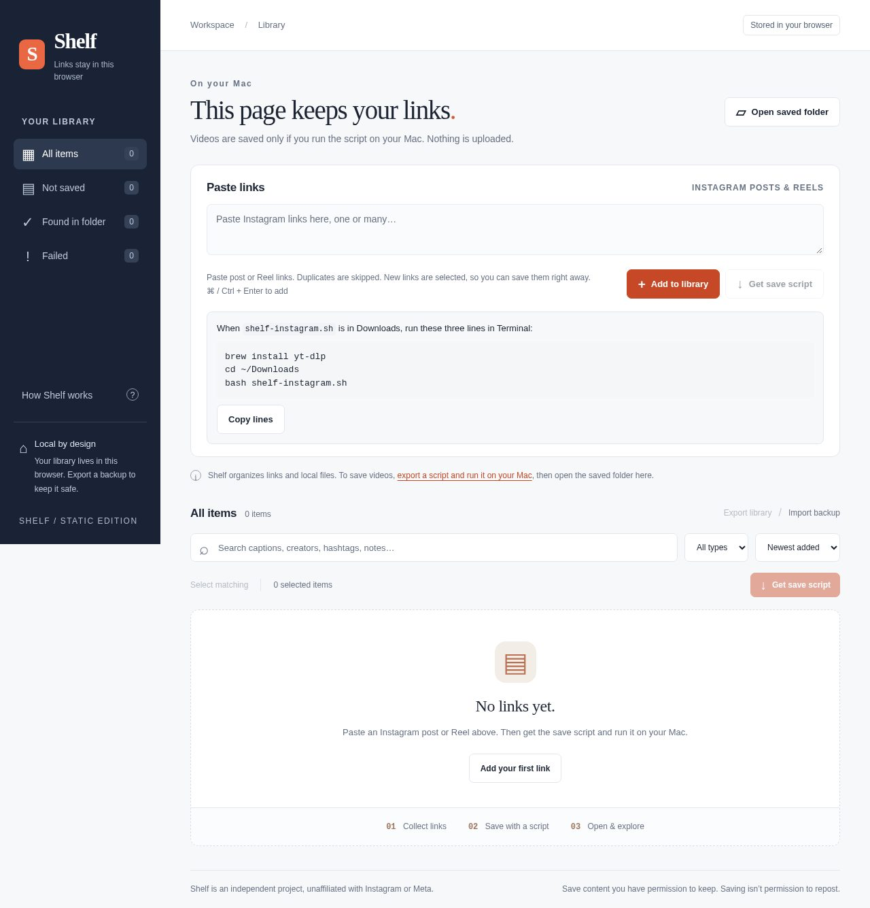

# Shelf

Collect, keep, and find Instagram links in a personal library stored in your browser.

[](https://github.com/MiKhelangelo/shelf/actions/workflows/pages.yml)


**[Open Shelf](https://mikhelangelo.github.io/shelf/)** · [Read the guide](docs/guide.md) · [Report an issue](https://github.com/MiKhelangelo/shelf/issues)



Shelf gives your finds a place to stay: add links, write notes, and search them later. Connect a folder of your own videos to explore captions and play local files. An optional download script helps you save videos on your Mac.

| Make it yours | What Shelf does |
| --- | --- |
| Collect | Keep Instagram posts and Reels; skip duplicate links. |
| Remember | Add personal titles, notes, and searchable hashtags. |
| Find again | Search your library and play videos from a folder you choose. |
| Keep a copy | Export and import a JSON backup of links and metadata. |

## How it works

1. **Collect links.** Paste posts or Reels, then add a title or note.
2. **Use your library.** Search your finds and export a backup whenever you need one.
3. **Save files, optionally.** Select links, choose **Copy script**, and review it before saving and running it with [yt-dlp](https://github.com/yt-dlp/yt-dlp/wiki/Installation) in Terminal on your Mac.
4. **Connect your folder.** Choose **Open saved folder** to index captions and play local videos. Reopen the folder after a reload to reconnect playback.

The script runs in Terminal, never in the browser. It uses no login cookies. Instagram can require login or block requests, so downloads may fail. The link library works without the script.

The page sends no library or file data to a service; GitHub Pages receives ordinary page requests. Browser storage can be cleared, and JSON backups contain metadata, not videos. The [guide](docs/guide.md) explains storage, limits, statuses, and the script's network requests.

## Run locally

No frontend build or package installation is required. From the repository root:

```bash
python3 -m http.server 4173 --bind 127.0.0.1
```

Open [localhost:4173](http://127.0.0.1:4173). To run the tests with Node.js 18+:

```bash
node --test tests/lib.test.js
```

[Usage & deployment guide](docs/guide.md) · [Professional review](REVIEW.md) · [Script source](shelf-script.js) · [Tests](tests/lib.test.js)

Independent project, unaffiliated with Instagram or Meta. Save content you have permission to keep; saving does not grant permission to repost.
